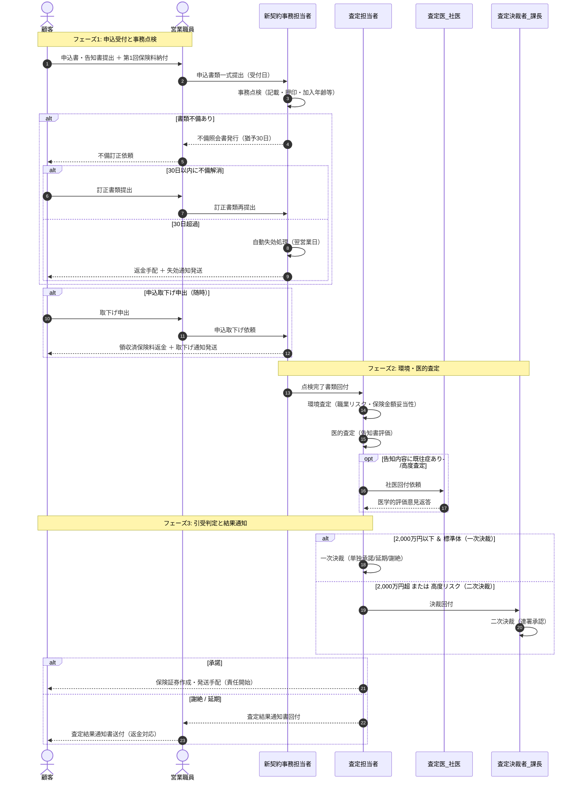

# **新契約受付～査定結果通知業務 業務フロー定義書 (V1)**

**文書ID:** DOC-BUS-003  
**関連仕様書:** [ビジネス仕様書 (DOC-BUS-001)](./new_business_business_specification_v01.md), [ビジネスルール仕様書 (DOC-BUS-002)](./new_business_business_rules_v01.md)  
**発行日:** 1980年1月1日（昭和55年1月1日）  
**バージョン:** V1  
**管轄部署:** 新契約部 / 査定部  

---

## **1. 業務フロー概要**

本業務フローは、営業職員を介して顧客から提出された終身保険の申込書・告知書の受付から、事務点検、環境査定・医的査定、引受決裁、および最終結果（保険証券または結果通知書）の送付手配に至る一連のプロセスを定義する。

* **開始トリガー:** 営業職員による申込書・告知書等の支社受領および第1回保険料の領収
* **正常終了トリガー:** 承諾決裁の完了および保険証券の発行・送付手配完了（責任開始日の確定）
* **例外終了トリガー:** 査定による謝絶・延期通知発送、不備未解消による手続自動失効（30日経過）、または顧客による申込取下げ

---

## **2. プロセスレーン図 (BPMN / スイムレーン)**

---

## **3. 各ステップ詳細説明**

| Step | フェーズ | アクター | 実行作業 | 入力成果物 | 出力成果物 | 例外フロー |
| :--- | :--- | :--- | :--- | :--- | :--- | :--- |
| **1** | 申込受付 | 顧客・営業職員 | 申込書・告知書の作成および第1回保険料の受領。支社受付窓口への回付。 | 申込書面、告知書面、保険料 | 申込書類一式、領収控 | - |
| **2** | 事務点検 | 新契約事務担当者 | 記載漏れ、印鑑相違、年齢制限（15～65歳）、商品適合性（終身保険）等の点検。 | 申込書類一式 | 点検完了済書類 または 不備照会票 | 不備発見時はStep 3へ遷移。 |
| **3** | 不備対応・期限管理 | 新契約事務担当者 | 営業職員を通じた不備訂正依頼。起票日より30日間の手続猶予期間の管理。 | 不備照会票 | 訂正済申込書類 または 失効処理票 | 30日超過時は自動失効とし返金・手続打切り。 |
| **4** | 取下げ処理 | 新契約事務担当者 | 契約成立前の顧客からの申込取下げ申出を受付し、手続を中止。 | 申込取下げ請求書 | 返金指示書、取下げ通知 | 返金手続（領収済保険料がある場合）。 |
| **5** | 環境査定 | 査定担当者 | 被保険者の職業危険度確認、単一申込上限（5,000万円）およびモラルリスク評価。 | 点検完了済申込書 | 環境査定結果記録 | 評価NGの場合は謝絶判定へ。 |
| **6** | 医的査定 | 査定担当者 | 告知書に基づく既往歴・健康状態の医学的リスク評価。 | 告知書面 | 医的査定結果記録 | 専門的判定が必要な場合はStep 7へ。 |
| **7** | 社医回付 | 査定医（社医） | 査定担当者からの回付案件に対する専門医的観点からのリスク判定。 | 告知書・診断書面 | 社医意見書 | 追加診断が必要な場合は査定保留。 |
| **8** | 引受決裁 | 査定担当者 / 査定決裁者 | 査定決裁権限マトリクス（2,000万円閾値・リスク区分）に基づく最終決定。 | 総合査定記録 | 決裁完了票（承諾/延期/謝絶） | 権限超過時は査定課長へ連署回付。 |
| **9** | 結果通知・証券発行 | 事務・発送担当 | 決裁結果に応じた公式帳票の発行・発送手配。責任開始日の確定。 | 決裁完了票 | 保険証券、謝絶通知書、返金票 | 送付不能時は営業職員経由で確認。 |

---

## **4. 関連ドキュメント**

* **[ビジネス仕様書 (DOC-BUS-001)](./new_business_business_specification_v01.md)**
* **[ビジネスルール仕様書 (DOC-BUS-002)](./new_business_business_rules_v01.md)**
* **[業務用語集 (DOC-BUS-004)](./new_business_business_glossary_v01.md)**
