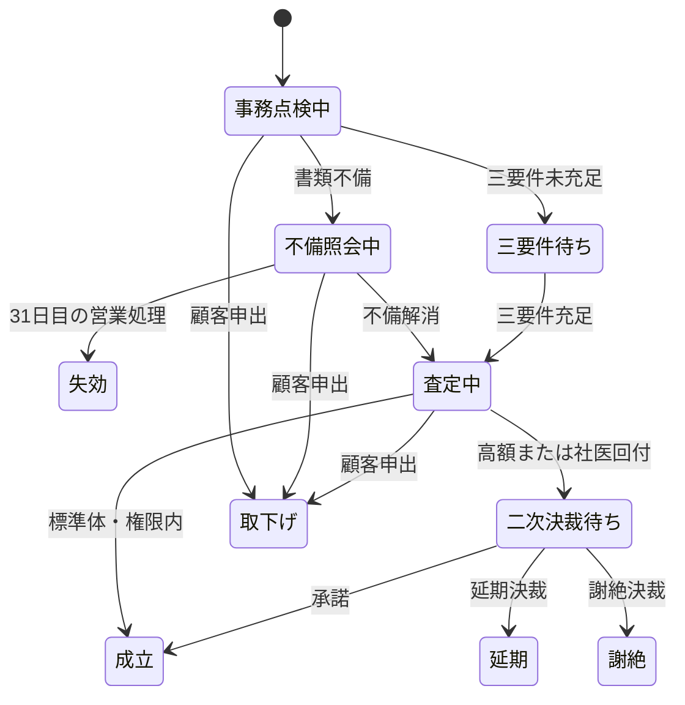

# 新契約査定システム 外部設計書 (V1)

**文書ID:** DOC-EXT-V1-001  
**対象Version:** V1（1980年）  
**上位文書:** [要件定義書](../../requirements/v01/new_business_system_requirements_v01.md)

## 1. システム構成

文字端末処理と夜間バッチは同一メインフレーム内で稼働する。申込ファイルが受渡し境界であり、夜間査定後の結果ファイルを帳票作成工程へ渡す。

## 2. 機能一覧

| 機能ID | プログラム | 種別 | 概要 | 要件 |
| :--- | :--- | :--- | :--- | :--- |
| `F-V1-001` | `NBENTRY` | オンライン | 文字端末入力、基本範囲点検、申込ファイル追記 | FR-V1-001, 002 |
| `F-V1-002` | `NBASSESS` | バッチ | 入力検証、不備期限、金額、医的区分、決裁経路の判定 | FR-V1-002〜010 |
| `F-V1-003` | `NBJOB01` | ジョブ | 日次査定の起動、戻り値と件数の運用確認 | NFR-V1-002 |

## 3. 論理データ

| エンティティ | 識別子 | 正本 | 説明 |
| :--- | :--- | :--- | :--- |
| 申込 | 申込番号 | `APPLICATION.DAT` | 査定前および継続中の申込情報 |
| 査定結果 | 申込番号 | `ASSESSMENT.DAT` | 当該実行日における判定結果 |
| 業務ルール | ルールID | 業務ルール仕様書 | 年齢、金額、期限、権限の正本 |

V1では査定結果ファイルを契約原簿そのものとは扱わない。成立後の契約原簿編成は今回の縦断範囲外である。

## 4. 状態遷移

## 5. 入出力ファイル

### 5.1 APPLICATION.DAT（FL-V1-001）

- 編成: 行順次、固定長120文字
- 文字集合: 実機はEBCDIC相当。教材リポジトリでは可搬なASCII互換文字だけを使用する。
- 数値: 符号なし表示数字、左ゼロ埋め
- 空値: 数値日付は `00000000`、文字コードは空白

| No | 項目 | 位置 | 長さ | 形式 | 説明 |
| ---: | :--- | :--- | ---: | :--- | :--- |
| 1 | 申込番号 | 1–10 | 10 | 9(10) | 一意な申込番号 |
| 2 | 申込日 | 11–18 | 8 | YYYYMMDD | 三要件の一つ |
| 3 | 告知日 | 19–26 | 8 | YYYYMMDD/0 | 三要件の一つ。未告知は0 |
| 4 | 第1回保険料領収日 | 27–34 | 8 | YYYYMMDD/0 | 三要件の一つ |
| 5 | 受付日 | 35–42 | 8 | YYYYMMDD | 事務点検SLA起算日 |
| 6 | 処理基準日 | 43–50 | 8 | YYYYMMDD | 日次バッチの業務日 |
| 7 | 不備照会起票日 | 51–58 | 8 | YYYYMMDD/0 | 不備期限の起算日 |
| 8 | 加入年齢 | 59–60 | 2 | 9(2) | 契約日時点年齢 |
| 9 | 死亡保険金額 | 61–68 | 8 | 9(8) | 円単位 |
| 10 | 商品コード | 69–70 | 2 | X(2) | `WL`のみ |
| 11 | 書類完備 | 71 | 1 | X | Y/N |
| 12 | 医的区分 | 72 | 1 | X | S/M |
| 13 | 二次決裁 | 73 | 1 | X | A/P/D/空白 |
| 14 | 取下げ | 74 | 1 | X | Y/N |
| 15 | 予約領域 | 75–120 | 46 | X | 空白。V1では使用禁止 |

### 5.2 ASSESSMENT.DAT（FL-V1-002）

- 編成: 行順次、固定長80文字

| No | 項目 | 位置 | 長さ | 形式 | 説明 |
| ---: | :--- | :--- | ---: | :--- | :--- |
| 1 | 申込番号 | 1–10 | 10 | 9(10) | 入力を引き継ぐ |
| 2 | 結果コード | 11–12 | 2 | X(2) | 要件定義4.2参照 |
| 3 | 決裁区分 | 13 | 1 | X | U/M/N |
| 4 | 理由コード | 14–16 | 3 | X(3) | 判定理由 |
| 5 | 責任開始日 | 17–24 | 8 | YYYYMMDD/0 | 承諾時のみ設定 |
| 6 | 処理基準日 | 25–32 | 8 | YYYYMMDD | 入力を引き継ぐ |
| 7 | 受付日 | 33–40 | 8 | YYYYMMDD | 入力を引き継ぐ |
| 8 | 予約領域 | 41–80 | 40 | X | 空白 |

## 6. バッチ処理設計

1. 申込ファイルを先頭から1件ずつ読む。
2. 申込番号を結果レコードへ移す。
3. 要件定義5章の優先順位で判定する。
4. 結果レコードを1件出力する。
5. 入力、出力、データエラー件数を集計する。
6. 入力件数と出力件数が一致しない場合は異常終了する。

データエラーは当該レコードの結果08として扱い、ジョブ全体は継続する。ファイルオープンまたは入出力異常はジョブ異常終了とする。

## 7. 日付判定

- 日付形式はGregorian暦の `YYYYMMDD` とする。
- うるう年は「4で割り切れ、100で割り切れる年は除外し、400で割り切れる年は含む」とする。
- 不備経過日数は `処理基準日 - 不備照会起票日` の暦日差とする。
- 経過日数30以下は結果04、31以上は結果05とする。
- 営業日そのものの休日判定はジョブ起動管理の責務とし、プログラム内では処理基準日を営業日として受け取る。

## 8. エラー処理

| 条件 | 処理 |
| :--- | :--- |
| 入力ファイルを開けない | 戻り値12、出力しない |
| 出力ファイルを開けない | 戻り値12、処理しない |
| 日付・コード・必須値不正 | 結果08、理由DAT/PRD等を出力し継続 |
| 入出力件数不一致 | 戻り値08 |
| 正常完了 | 戻り値00 |
