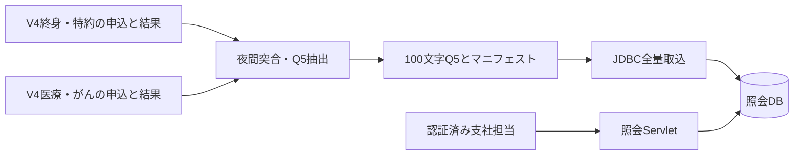

# V5 照会外部設計

対象Version: V5 
想定読者: 当時のJava開発・運用担当

## 境界

COBOL受付・査定を維持し、夜間抽出を経て照会DBへ一方向連携する。支社ブラウザはServlet経由で照会DBを参照する。原簿更新は行わない。

## 画面

/inquiry にGET。番号未指定は入力フォーム、10桁指定は照会。主契約進捗、商品別保障額、各日付、制度、理由を表示する。照会データ基準日と夜間情報である注記を必須とする。主契約承諾が特約承諾を意味する表示はしない。

未認証401、権限なし403、入力不正400、未存在404、データ取得不能503、更新メソッド405。データ更新の画面は設けない。認証主体・役割は社内コンテナから受け取る。Web接続はSELECT権限のみ。

## データ連携

ファイル名snapshot.dat、形式Q5、固定100文字ASCII。snapshot.propertiesにformat/asOf/count/sha256を格納する。変換の詳細は[変換表](fixed_length_mapping_v05.md)、公開制御は[内部設計](../../internal_design/v05/java_inquiry_internal_design_v05.md)による。

## 文書の範囲

本書は照会機能の設計。V4の設計本文は改訂しない。再告知が告知日を優先する理由と支社入力の全実態、例外再起票の承認背景は本書の説明範囲外。数値と日付を正しく転記することと、その由来を説明できることは別である。
