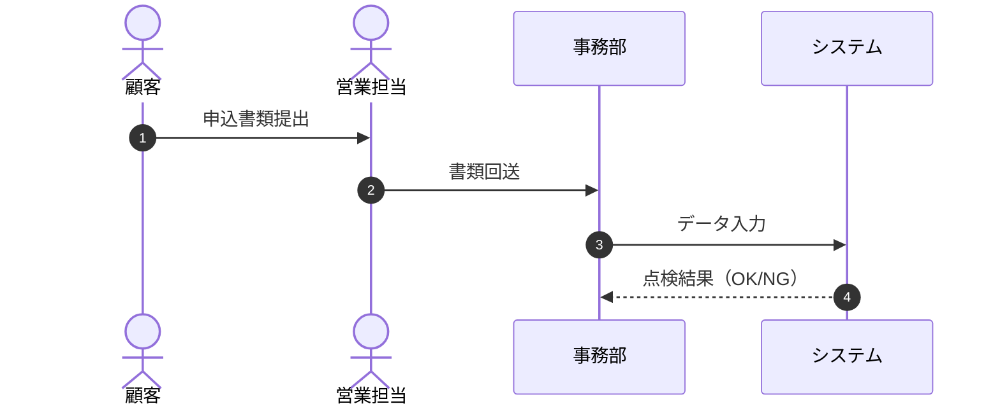

# **[システム・業務名] 業務フロー定義書**

**文書ID:** DOC-BUS-003  
**発行日:** YYYY-MM-DD  

---

## **1. 業務フロー概要**
*(全体プロセスの目的と開始・終了トリガー)*

## **2. プロセスレーン図 (BPMN / スイムレーン)**

## **3. 各ステップ詳細説明**
| Step | アクター | 実行作業 | 入力成果物 | 出力成果物 | 例外フロー |
| :--- | :--- | :--- | :--- | :--- | :--- |
| 1 | [アクター] | [作業内容] | [入力物] | [出力物] | [例外時処理] |
