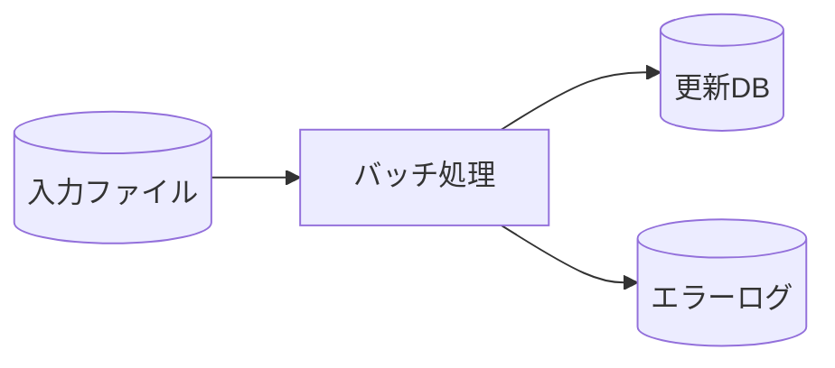

# **[ジョブ名] 機能設計書（バッチ）**

**文書ID:** DOC-EXT-006  
**ジョブID:** JOB-BAT-XXX  

---

## **1. バッチ概要・処理フロー**

## **2. 入出力リソース**
* **入力:** [入力ファイルレイアウト / DBテーブル]
* **出力:** [更新DBテーブル / 帳票データ]

## **3. 主処理ロジック仕様**
1. 入力レコードを1件ずつ読込。
2. 判定基準マトリクスに基づき査定ステータスを更新。
3. コミット単位（1,000件ごと）にデータベースを更新。
