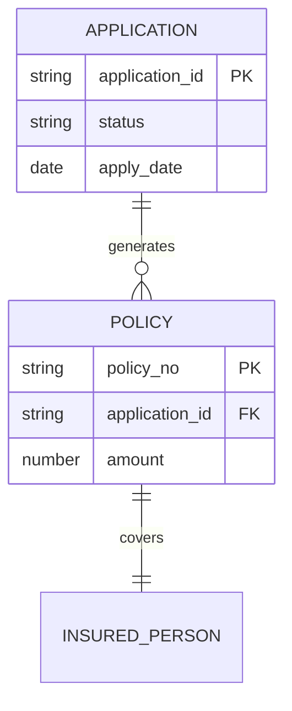

# **論理DB構造図 (論理ERD)**

**文書ID:** DOC-EXT-003  

---

## **1. 論理ER図**

## **2. 論理エンティティ一覧**
| エンティティ名（和名） | エンティティ名（英名） | 説明 | 主キー (PK) |
| :--- | :--- | :--- | :--- |
| [申込情報] | `APPLICATION` | 顧客の申込情報 | `application_id` |
