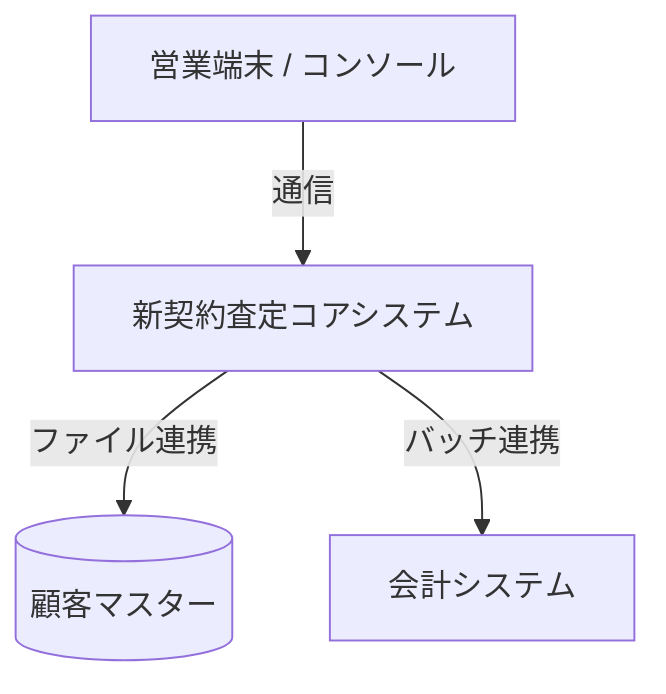

# **システム構成図・他システム関係図**

**文書ID:** DOC-EXT-001  

---

## **1. システム全体構成図**

## **2. 構成要素一覧**
| システム/コンポーネント名 | 役割・機能 | 設置場所/サーバー | 備考 |
| :--- | :--- | :--- | :--- |
| [コアシステム] | 引受査定ロジック実行 | [ホスト/APサーバー] | |
