# **ジョブスケジュール仕様書**

**文書ID:** DOC-TEC-004  

---

## **1. 日次バッチスケジュール**

```mermaid
gantt
    title 日次バッチ実行タイムライン
    dateFormat  HH:mm
    axisFormat %H:%mm
    データ受入バッチ : 23:00, 1h
    一次査定バッチ   : 00:00, 2h
    帳票作成バッチ   : 02:00, 1.5h
```

## **2. ジョブネット依存関係表**
| ジョブID | ジョブ名 | 起動条件 | 先行ジョブ | リトライ回数 |
| :--- | :--- | :--- | :--- | :--- |
| JOB-01 | 受入バッチ | 時刻 (23:00) | なし | 3回 |
| JOB-02 | 査定バッチ | 正常終了 | JOB-01 | 1回 |
